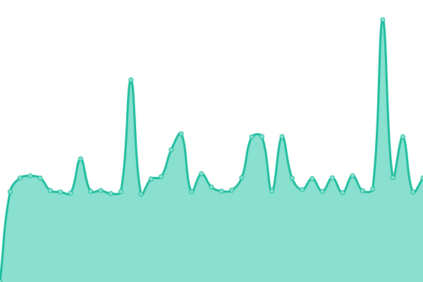
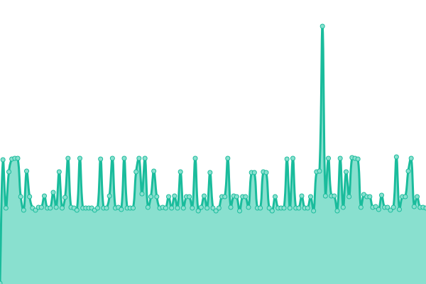

# [📈 Live Status](https://slovak-egov.github.io/upptime): <!--live status--> **🟧 Partial outage**

This repository contains the open-source uptime monitor and status page for [slovak-egov](https://mirri.gov.sk), powered by [Upptime](https://github.com/upptime/upptime).

With [Upptime](https://upptime.js.org), you can get your own unlimited and free uptime monitor and status page, powered entirely by a GitHub repository. We use [Issues](https://github.com/slovak-egov/upptime/issues) as incident reports, [Actions](https://github.com/slovak-egov/upptime/actions) as uptime monitors, and [Pages](https://slovak-egov.github.io/upptime) for the status page.

<!--start: status pages-->
<!-- This summary is generated by Upptime (https://github.com/upptime/upptime) -->
<!-- Do not edit this manually, your changes will be overwritten -->
<!-- prettier-ignore -->
| URL | Status | History | Response Time | Uptime |
| --- | ------ | ------- | ------------- | ------ |
|  [Web MIRRI SR](https://www.mirri.gov.sk) | 🟩 Up | [web-mirri-sr.yml](https://github.com/slovak-egov/upptime/commits/HEAD/history/web-mirri-sr.yml) | 

 3753ms
     
 | 

<a href="https://slovak-egov.github.io/upptime/history/web-mirri-sr">66.97%</a>
    

|  [Web MV SR](https://www.minv.sk) | 🟩 Up | [web-mv-sr.yml](https://github.com/slovak-egov/upptime/commits/HEAD/history/web-mv-sr.yml) | 

 1793ms
     
 | 

<a href="https://slovak-egov.github.io/upptime/history/web-mv-sr">57.19%</a>
    

|  [Web MZ SR](https://health.gov.sk) | 🟩 Up | [web-mz-sr.yml](https://github.com/slovak-egov/upptime/commits/HEAD/history/web-mz-sr.yml) | 

 1228ms
     
 | 

<a href="https://slovak-egov.github.io/upptime/history/web-mz-sr">66.97%</a>
    

|  [Web MD SR](https://www.mindop.sk) | 🟩 Up | [web-md-sr.yml](https://github.com/slovak-egov/upptime/commits/HEAD/history/web-md-sr.yml) | 

 1879ms
     
 | 

<a href="https://slovak-egov.github.io/upptime/history/web-md-sr">66.98%</a>
    

|  [Web MF SR](https://www.mfsr.sk/sk) | 🟩 Up | [web-mf-sr.yml](https://github.com/slovak-egov/upptime/commits/HEAD/history/web-mf-sr.yml) | 

 2009ms
     
 | 

<a href="https://slovak-egov.github.io/upptime/history/web-mf-sr">99.94%</a>
    

|  [Web MH SR](https://www.mhsr.sk) | 🟩 Up | [web-mh-sr.yml](https://github.com/slovak-egov/upptime/commits/HEAD/history/web-mh-sr.yml) | 

 2025ms
     
 | 

<a href="https://slovak-egov.github.io/upptime/history/web-mh-sr">0.00%</a>
    

|  [Web MK SR](https://www.culture.gov.sk) | 🟩 Up | [web-mk-sr.yml](https://github.com/slovak-egov/upptime/commits/HEAD/history/web-mk-sr.yml) | 

 2808ms
     
 | 

<a href="https://slovak-egov.github.io/upptime/history/web-mk-sr">66.98%</a>
    

|  [Web MO SR](https://www.mosr.sk) | 🟩 Up | [web-mo-sr.yml](https://github.com/slovak-egov/upptime/commits/HEAD/history/web-mo-sr.yml) | 

 1356ms
     
 | 

<a href="https://slovak-egov.github.io/upptime/history/web-mo-sr">100.00%</a>
    

|  [Web MP SR](https://www.mpsr.sk) | 🟥 Down | [web-mp-sr.yml](https://github.com/slovak-egov/upptime/commits/HEAD/history/web-mp-sr.yml) | 

 78ms
     
 | 

<a href="https://slovak-egov.github.io/upptime/history/web-mp-sr">0.00%</a>
    

|  [Web MPSVaR SR](https://www.employment.gov.sk/sk) | 🟩 Up | [web-mps-va-r-sr.yml](https://github.com/slovak-egov/upptime/commits/HEAD/history/web-mps-va-r-sr.yml) | 

 2285ms
     
 | 

<a href="https://slovak-egov.github.io/upptime/history/web-mps-va-r-sr">81.91%</a>
    

|  [Web MŠVVaM SR](https://www.minedu.sk) | 🟩 Up | [web-msv-va-m-sr.yml](https://github.com/slovak-egov/upptime/commits/HEAD/history/web-msv-va-m-sr.yml) | 

 1020ms
     
 | 

<a href="https://slovak-egov.github.io/upptime/history/web-msv-va-m-sr">42.64%</a>
    

|  [Web MZV SR](https://www.mzv.sk) | 🟩 Up | [web-mzv-sr.yml](https://github.com/slovak-egov/upptime/commits/HEAD/history/web-mzv-sr.yml) | 

 3869ms
     
 | 

<a href="https://slovak-egov.github.io/upptime/history/web-mzv-sr">66.92%</a>
    

|  [Web MŽP SR](https://www.minzp.sk) | 🟩 Up | [web-mzp-sr.yml](https://github.com/slovak-egov/upptime/commits/HEAD/history/web-mzp-sr.yml) | 

 769ms
     
 | 

<a href="https://slovak-egov.github.io/upptime/history/web-mzp-sr">66.99%</a>
    

|  [Web MCRS SR](https://mincrs.sk) | 🟩 Up | [web-mcrs-sr.yml](https://github.com/slovak-egov/upptime/commits/HEAD/history/web-mcrs-sr.yml) | 

 1656ms
     
 | 

<a href="https://slovak-egov.github.io/upptime/history/web-mcrs-sr">99.93%</a>
    

|  [Web MS SR](https://www.justice.gov.sk) | 🟩 Up | [web-ms-sr.yml](https://github.com/slovak-egov/upptime/commits/HEAD/history/web-ms-sr.yml) | 

 2125ms
     
 | 

<a href="https://slovak-egov.github.io/upptime/history/web-ms-sr">66.99%</a>
    

|  [Web Slovensko.sk (ÚPVS)](https://www.slovensko.sk) | 🟩 Up | [web-slovensko-sk-upvs.yml](https://github.com/slovak-egov/upptime/commits/HEAD/history/web-slovensko-sk-upvs.yml) | 

 2418ms
     
 | 

<a href="https://slovak-egov.github.io/upptime/history/web-slovensko-sk-upvs">100.00%</a>
    

|  [Web NASES](https://nases.gov.sk) | 🟩 Up | [web-nases.yml](https://github.com/slovak-egov/upptime/commits/HEAD/history/web-nases.yml) | 

 1110ms
     
 | 

<a href="https://slovak-egov.github.io/upptime/history/web-nases">100.00%</a>
    

|  [Web Sociálna poisťovňa](https://www.socpoist.sk) | 🟩 Up | [web-socialna-poistovna.yml](https://github.com/slovak-egov/upptime/commits/HEAD/history/web-socialna-poistovna.yml) | 

 1091ms
     
 | 

<a href="https://slovak-egov.github.io/upptime/history/web-socialna-poistovna">99.54%</a>
    

|  [Web Úrad na ochranu osobných údajov](https://dataprotection.gov.sk/sk/) | 🟩 Up | [web-urad-na-ochranu-osobnych-udajov.yml](https://github.com/slovak-egov/upptime/commits/HEAD/history/web-urad-na-ochranu-osobnych-udajov.yml) | 

 6215ms
     
 | 

<a href="https://slovak-egov.github.io/upptime/history/web-urad-na-ochranu-osobnych-udajov">66.99%</a>
    

|  [Slov Lex](https://www.slov-lex.sk) | 🟩 Up | [slov-lex.yml](https://github.com/slovak-egov/upptime/commits/HEAD/history/slov-lex.yml) | 

 564ms
     
 | 

<a href="https://slovak-egov.github.io/upptime/history/slov-lex">100.00%</a>
    

|  [Centrálny register zmluv SR](https://crz.gov.sk) | 🟩 Up | [centralny-register-zmluv-sr.yml](https://github.com/slovak-egov/upptime/commits/HEAD/history/centralny-register-zmluv-sr.yml) | 

 1172ms
     
 | 

<a href="https://slovak-egov.github.io/upptime/history/centralny-register-zmluv-sr">98.46%</a>
    

|  [MetaIS](https://metais.slovensko.sk) | 🟩 Up | [meta-is.yml](https://github.com/slovak-egov/upptime/commits/HEAD/history/meta-is.yml) | 

 473ms
     
 | 

<a href="https://slovak-egov.github.io/upptime/history/meta-is">99.93%</a>
    

|  [MetaIS CMDB API](https://metais.slovensko.sk/api/cmdb/read/cilist) | 🟩 Up | [meta-is-cmdb-api.yml](https://github.com/slovak-egov/upptime/commits/HEAD/history/meta-is-cmdb-api.yml) | 

 408ms
     
 | 

<a href="https://slovak-egov.github.io/upptime/history/meta-is-cmdb-api">99.21%</a>
    

|  [Web Centrálna Integračná Platforma](https://cip.gov.sk/portal) | 🟥 Down | [web-centralna-integracna-platforma.yml](https://github.com/slovak-egov/upptime/commits/HEAD/history/web-centralna-integracna-platforma.yml) | 

 0ms
     
 | 

<a href="https://slovak-egov.github.io/upptime/history/web-centralna-integracna-platforma">0.00%</a>
    

|  [Web Centrálna API Manažment Platforma](https://portal.camp.slovensko.sk/) | 🟥 Down | [web-centralna-api-manazment-platforma.yml](https://github.com/slovak-egov/upptime/commits/HEAD/history/web-centralna-api-manazment-platforma.yml) | 

 0ms
     
 | 

<a href="https://slovak-egov.github.io/upptime/history/web-centralna-api-manazment-platforma">0.00%</a>
    

|  [Web data.gov.sk](https://data.gov.sk) | 🟩 Up | [web-data-gov-sk.yml](https://github.com/slovak-egov/upptime/commits/HEAD/history/web-data-gov-sk.yml) | 

 1328ms
     
 | 

<a href="https://slovak-egov.github.io/upptime/history/web-data-gov-sk">66.98%</a>
    

|  [Národný katalóg otvorených dát](https://data.slovensko.sk) | 🟩 Up | [narodny-katalog-otvorenych-dat.yml](https://github.com/slovak-egov/upptime/commits/HEAD/history/narodny-katalog-otvorenych-dat.yml) | 

 115ms
     
 | 

<a href="https://slovak-egov.github.io/upptime/history/narodny-katalog-otvorenych-dat">100.00%</a>
    

|  [Web Dátová interoperabilita](https://znalosti.gov.sk) | 🟩 Up | [web-datova-interoperabilita.yml](https://github.com/slovak-egov/upptime/commits/HEAD/history/web-datova-interoperabilita.yml) | 

 927ms
     
 | 

<a href="https://slovak-egov.github.io/upptime/history/web-datova-interoperabilita">66.98%</a>
    

|  [Portál ID-SK](https://idsk.gov.sk) | 🟩 Up | [portal-id-sk.yml](https://github.com/slovak-egov/upptime/commits/HEAD/history/portal-id-sk.yml) | 

 871ms
     
 | 

<a href="https://slovak-egov.github.io/upptime/history/portal-id-sk">66.99%</a>
    

|  [SVM Enrollment Portál](https://ep.slovensko.sk/titulna-stranka) | 🟩 Up | [svm-enrollment-portal.yml](https://github.com/slovak-egov/upptime/commits/HEAD/history/svm-enrollment-portal.yml) | 

 978ms
     
 | 

<a href="https://slovak-egov.github.io/upptime/history/svm-enrollment-portal">66.99%</a>
    

|  [Repo eID MV SR](https://eidas.minv.sk/download) | 🟩 Up | [repo-e-id-mv-sr.yml](https://github.com/slovak-egov/upptime/commits/HEAD/history/repo-e-id-mv-sr.yml) | 

 1264ms
     
 | 

<a href="https://slovak-egov.github.io/upptime/history/repo-e-id-mv-sr">100.00%</a>
    

|  [Katastrálna mapa](https://kataster.skgeodesy.sk/GisPortal) | 🟥 Down | [katastralna-mapa.yml](https://github.com/slovak-egov/upptime/commits/HEAD/history/katastralna-mapa.yml) | 

 851ms
     
 | 

<a href="https://slovak-egov.github.io/upptime/history/katastralna-mapa">0.00%</a>
    

|  [Web Register partnerov VS](https://rpvs.gov.sk/rpvs) | 🟩 Up | [web-register-partnerov-vs.yml](https://github.com/slovak-egov/upptime/commits/HEAD/history/web-register-partnerov-vs.yml) | 

 718ms
     
 | 

<a href="https://slovak-egov.github.io/upptime/history/web-register-partnerov-vs">66.99%</a>
    

|  [Web SNCA](https://snca.gov.sk) | 🟩 Up | [web-snca.yml](https://github.com/slovak-egov/upptime/commits/HEAD/history/web-snca.yml) | 

 1380ms
     
 | 

<a href="https://slovak-egov.github.io/upptime/history/web-snca">66.99%</a>
    

|  [GovNet Mail GW](mail.gov.sk) | 🟩 Up | [gov-net-mail-gw.yml](https://github.com/slovak-egov/upptime/commits/HEAD/history/gov-net-mail-gw.yml) | 

 129ms
     
 | 

<a href="https://slovak-egov.github.io/upptime/history/gov-net-mail-gw">67.00%</a>
    

|  [GovNet DNS1 GW](195.49.191.160) | 🟩 Up | [gov-net-dns-1-gw.yml](https://github.com/slovak-egov/upptime/commits/HEAD/history/gov-net-dns-1-gw.yml) | 

 128ms
     
 | 

<a href="https://slovak-egov.github.io/upptime/history/gov-net-dns-1-gw">100.00%</a>
    

|  [GovNet DNS2 GW](195.49.191.162) | 🟩 Up | [gov-net-dns-2-gw.yml](https://github.com/slovak-egov/upptime/commits/HEAD/history/gov-net-dns-2-gw.yml) | 

 128ms
     
 | 

<a href="https://slovak-egov.github.io/upptime/history/gov-net-dns-2-gw">67.02%</a>
    

<!--end: status pages-->

[**Visit our status website →**](https://slovak-egov.github.io/upptime)

## 📄 License

- Powered by: [Upptime](https://github.com/upptime/upptime)
- Code: [MIT](./LICENSE) © [Anand Chowdhary](https://anandchowdhary.com), supported by [Pabio](https://pabio.com)
- Data in the `./history` directory: [Open Database License](https://opendatacommons.org/licenses/odbl/1-0/)
